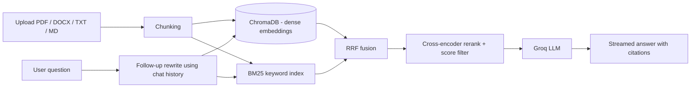

# Enterprise Hybrid RAG Engine

A document question-answering system that combines **dense vector search** and **keyword search**, reranks the results with a cross-encoder, and generates grounded answers with citations using a Groq-hosted LLM.

Upload PDF, DOCX, TXT or Markdown files, then ask questions in a chat UI. Every answer cites its sources (file and page), and questions that are not covered by your documents get a clean "not found" instead of a made-up answer.

## How it works



1. **Ingestion:** files are split into overlapping chunks and indexed in ChromaDB (embeddings) and BM25 (keywords).
2. **Query rewriting:** follow-up questions such as "tell me more about that" are rewritten into standalone questions using recent chat history.
3. **Hybrid retrieval:** dense and BM25 results are merged with Reciprocal Rank Fusion (RRF).
4. **Reranking:** a cross-encoder scores each candidate against the question; chunks below a threshold are dropped.
5. **Generation:** the remaining chunks are sent to a Groq LLM, which answers only from that context and cites sources like `[1]`.

## Features

- Hybrid search (ChromaDB + BM25) with RRF fusion and cross-encoder reranking
- Source citations with file name, page number and rerank score
- Streaming answers
- Multi-turn chat memory via question rewriting
- Off-topic questions return "not found" (configurable score threshold)
- Optional API-key authentication and upload size limit
- Persistent index (survives restarts)
- Docker Compose setup for the API and UI

## Tech stack

| Tool | Purpose |
|---|---|
| Python | Main language |
| LangChain | Document loading, splitting, retrievers, LLM integration |
| ChromaDB | Vector store for embeddings |
| BM25 (`rank_bm25`) | Keyword retrieval |
| Sentence Transformers | Embeddings (`all-MiniLM-L6-v2`) and cross-encoder reranking (`ms-marco-MiniLM-L-6-v2`) |
| Groq API | LLM answer generation |
| FastAPI | Backend API |
| Streamlit | Chat UI |
| Docker | Packaging and deployment |

## Quick start

You need a free API key from [console.groq.com](https://console.groq.com).

### Option 1: Docker

```bash
cp .env.example .env        # then add your GROQ_API_KEY
docker compose up --build
```

- UI: http://localhost:8501
- API docs: http://localhost:8000/docs

### Option 2: Local (Python 3.10+)

```bash
python -m venv venv
venv\Scripts\activate            # Windows
# source venv/bin/activate       # macOS / Linux

pip install torch --index-url https://download.pytorch.org/whl/cpu
pip install -r requirements.txt

cp .env.example .env             # then add your GROQ_API_KEY
```

Run the backend and the UI in two terminals (activate the venv in both):

```bash
python -m uvicorn app.main:app
python -m streamlit run ui/streamlit_app.py
```

The first start downloads the embedding and reranker models, which can take a few minutes.

## Configuration

Set these in `.env`:

| Variable | Default | Description |
|---|---|---|
| `GROQ_API_KEY` | none | Your Groq API key (required) |
| `LLM_MODEL` | `openai/gpt-oss-120b` | Groq model name. Available models differ by account, so pick one from your Groq console |
| `MIN_RERANK_SCORE` | `-2.0` | Chunks scoring below this are dropped. Lower it if good questions return "not found" |
| `CHUNK_SIZE` / `CHUNK_OVERLAP` | `700` / `100` | Chunking settings. Re-upload documents after changing them |
| `FINAL_TOP_N` | `4` | Chunks sent to the LLM |
| `MAX_HISTORY_TURNS` | `3` | Chat turns used for follow-up questions |
| `API_KEY` | empty | If set, API requests need an `X-API-Key` header |
| `MAX_UPLOAD_MB` | `25` | Maximum upload size |

## API

| Method | Endpoint | Description |
|---|---|---|
| POST | `/ingest` | Upload and index a file |
| POST | `/query` | Ask a question (JSON response) |
| POST | `/query/stream` | Ask a question (streamed NDJSON) |
| GET | `/documents` | List indexed documents |
| DELETE | `/documents/{name}` | Remove a document |
| GET | `/health` | Status |

Example:

```bash
curl -X POST http://localhost:8000/query \
  -H "Content-Type: application/json" \
  -d '{"question": "What are the types of JOIN?", "top_n": 4}'
```

## Project structure

```
app/
  config.py       settings from environment variables
  ingestion.py    file loading and chunking
  retriever.py    hybrid retrieval, RRF, reranking
  generator.py    query rewriting, prompts, Groq calls, streaming
  main.py         FastAPI app
ui/
  streamlit_app.py
Dockerfile
docker-compose.yml
requirements.txt
```

## Limitations

- Scanned (image-only) PDFs are not supported because there is no OCR.
- All documents live in a single collection, with one shared API key and no per-user access control.
- The BM25 index is rebuilt after every upload, which is fine for thousands of chunks but not for very large collections.

## Screenshots

Add screenshots of the chat UI here, for example `docs/chat.png`.
