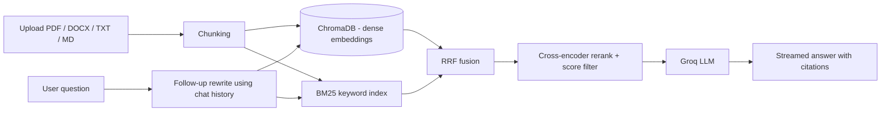

<div align="center">

# 🔎 Enterprise Hybrid RAG Engine

**Ask questions about your own documents and get grounded answers with citations.**

Hybrid retrieval (vector + keyword) · cross-encoder reranking · streaming answers · chat memory


</div>

---

## Table of contents

- [Overview](#overview)
- [Features](#features)
- [Architecture](#architecture)
- [Why hybrid retrieval?](#why-hybrid-retrieval)
- [Tech stack](#tech-stack)
- [Quick start](#quick-start)
- [Configuration](#configuration)
- [API reference](#api-reference)
- [Project structure](#project-structure)
- [Design decisions](#design-decisions)
- [Limitations](#limitations)
- [Roadmap](#roadmap)

## Overview

Upload PDF, DOCX, TXT or Markdown files and chat with them. Every answer cites the file and page it came from. If your documents do not contain the answer, the system says so instead of inventing one.

Example questions (for a SQL handbook):

- *What are the types of JOIN?*
- *Explain primary keys.* then the follow-up *How are they different from foreign keys?*
- *What is Python?* returns "not found", because the handbook does not cover it.

<!-- Add a screenshot of the chat UI here:   -->

## Features

- **Hybrid retrieval:** ChromaDB (semantic) plus BM25 (keywords), merged with Reciprocal Rank Fusion
- **Cross-encoder reranking** of candidates, with a score threshold that filters out irrelevant chunks
- **Cited answers:** inline `[1]`, `[2]` markers, plus a sources panel with file, page and rerank score
- **Streaming responses** in the chat UI
- **Multi-turn chat memory:** follow-up questions are rewritten into standalone queries before retrieval
- **Document management:** upload, list and delete documents from the UI; the index persists across restarts
- **Optional API-key authentication** and an upload size limit
- **Docker Compose** setup for the API and UI

## Architecture



1. **Ingestion:** files are loaded, split into overlapping chunks, and indexed in both ChromaDB and BM25.
2. **Query rewriting:** a follow-up like "how are they different?" becomes a standalone question using recent chat history.
3. **Retrieval:** the dense and keyword result lists are merged with Reciprocal Rank Fusion.
4. **Reranking:** a cross-encoder scores each candidate against the question; chunks below the threshold are dropped.
5. **Generation:** the remaining chunks go to a Groq LLM that answers only from that context and cites its sources.

## Why hybrid retrieval?

| Approach | Good at | Weak at |
|---|---|---|
| Vector search | Meaning and paraphrases ("car" matches "automobile") | Exact terms such as error codes, names and IDs |
| BM25 keyword search | Exact words and rare terms | Synonyms and rephrased questions |
| **Hybrid + rerank** | Covers both, then orders the best candidates precisely | Slightly more compute per query |

## Tech stack

| Tool | Purpose |
|---|---|
| Python | Main language |
| LangChain | Document loading, text splitting, BM25 retriever, LLM integration |
| ChromaDB | Vector store for document embeddings |
| BM25 (`rank_bm25`) | Keyword-based retrieval |
| Sentence Transformers | Embeddings (`all-MiniLM-L6-v2`) and reranking (`ms-marco-MiniLM-L-6-v2`) |
| Groq API | LLM answer generation |
| FastAPI | Backend API |
| Streamlit | Chat user interface |
| Docker | Packaging and deployment |

## Quick start

You need a free API key from [console.groq.com](https://console.groq.com).

### Option 1: Docker

```bash
git clone https://github.com/YOUR-USERNAME/enterprise-hybrid-rag.git
cd enterprise-hybrid-rag

cp .env.example .env          # Windows: copy .env.example .env
# open .env and set GROQ_API_KEY

docker compose up --build
```

- UI: http://localhost:8501
- API docs: http://localhost:8000/docs

### Option 2: Run locally (Python 3.10+)

```bash
git clone https://github.com/YOUR-USERNAME/enterprise-hybrid-rag.git
cd enterprise-hybrid-rag

python -m venv venv
venv\Scripts\activate         # Windows
# source venv/bin/activate    # macOS / Linux

pip install torch --index-url https://download.pytorch.org/whl/cpu
pip install -r requirements.txt

cp .env.example .env          # Windows: copy .env.example .env
# open .env and set GROQ_API_KEY
```

Start the backend and the UI in two separate terminals (activate the venv in both):

```bash
python -m uvicorn app.main:app
```

```bash
python -m streamlit run ui/streamlit_app.py
```

Open http://localhost:8501, upload a document, and start asking questions. The first start downloads the embedding and reranker models, which can take a few minutes.

> **Note:** the models available on Groq differ by account. If you see a `model_not_found` error, set `LLM_MODEL` in `.env` to a chat model listed in your Groq console.

## Configuration

All settings are read from `.env`:

| Variable | Default | Description |
|---|---|---|
| `GROQ_API_KEY` | none | Your Groq API key (required) |
| `LLM_MODEL` | `openai/gpt-oss-120b` | Groq chat model to use |
| `MIN_RERANK_SCORE` | `-2.0` | Chunks scoring below this are dropped. Lower it if good questions return "not found" |
| `CHUNK_SIZE` / `CHUNK_OVERLAP` | `700` / `100` | Chunking settings. Re-upload documents after changing them |
| `FINAL_TOP_N` | `4` | Number of chunks sent to the LLM |
| `MAX_HISTORY_TURNS` | `3` | Chat turns used to resolve follow-up questions |
| `API_KEY` | empty | If set, API requests must include an `X-API-Key` header |
| `MAX_UPLOAD_MB` | `25` | Maximum upload size |

## API reference

Interactive docs are available at `/docs` when the backend is running.

| Method | Endpoint | Description |
|---|---|---|
| `POST` | `/ingest` | Upload and index a file |
| `POST` | `/query` | Ask a question, returns the full answer as JSON |
| `POST` | `/query/stream` | Ask a question, streams the answer as NDJSON |
| `GET` | `/documents` | List indexed documents with chunk counts |
| `DELETE` | `/documents/{name}` | Remove a document |
| `GET` | `/health` | Service status |

Example request:

```bash
curl -X POST http://localhost:8000/query \
  -H "Content-Type: application/json" \
  -d '{"question": "What are the types of JOIN?", "top_n": 4}'
```

Example response (shortened):

```json
{
  "answer": "SQL supports several join types ... [1]",
  "standalone_question": "What are the types of JOIN?",
  "sources": [
    { "source": "sqlhandbook.pdf", "page": 12, "score": 8.19, "text": "..." }
  ]
}
```

If `API_KEY` is set, add `-H "X-API-Key: your-key"` to every request.

## Project structure

```
.
├── app/
│   ├── config.py          # settings from environment variables
│   ├── ingestion.py       # file loading and chunking
│   ├── retriever.py       # hybrid retrieval, RRF fusion, reranking
│   ├── generator.py       # query rewriting, prompts, Groq calls, streaming
│   └── main.py            # FastAPI application
├── ui/
│   └── streamlit_app.py   # chat interface
├── Dockerfile
├── docker-compose.yml
├── requirements.txt
└── .env.example
```

## Design decisions

- **RRF for fusion:** dense and BM25 scores are on different scales, so merging by rank (RRF) avoids having to normalize them.
- **Rerank after fusion:** the cross-encoder is slower than vector search, so it only scores the top candidates, not the whole index.
- **Score threshold instead of trusting the LLM alone:** dropping low-scoring chunks makes "not found" answers reliable for off-topic questions.
- **Query rewriting for memory:** retrieval needs a self-contained question, so follow-ups are rewritten before searching rather than embedding raw chat history.
- **Local embeddings and reranker:** only answer generation calls an external API, so documents are never sent to a third-party embedding service.
- **Citation normalization:** some models emit non-standard citation markers; the generator converts them to `[1]` format, including while streaming.

## Limitations

- Scanned (image-only) PDFs are not supported because there is no OCR.
- All documents share one collection and one API key; there is no per-user access control.
- The BM25 index is rebuilt after each upload. This is fine for thousands of chunks but not for very large collections.
- Retrieval quality has not been benchmarked on a labeled dataset yet.

## Roadmap

- [ ] OCR support for scanned PDFs
- [ ] Per-user authentication and department-level collections
- [ ] Automated retrieval and answer evaluation (for example RAGAS)
- [ ] Incremental BM25 index updates for large collections
- [ ] Support for more file types (Excel, PowerPoint, web pages)
